# CRM系统框架设计稿（V0.1 初稿）

> 本文档为 CRM 系统的初步框架设计，提炼核心业务实体、流程与生命周期，作为详细设计的基础骨架。
> 详细规则以 [需求说明.md](需求说明.md) 和 [业务实体.md](业务实体.md) 为准。

## 1. 系统定位

以客户为中心，覆盖 **客户获取 → 负责人分配 → 持续跟进 → 商机推进 → 项目立项 → 成交维护** 全过程。

| 项目 | 说明 |
| --- | --- |
| 终端形态 | 钉钉内 H5 及 PC 浏览器 |
| 身份认证 | 钉钉账号登录 |
| 设计原则 | 一个事实来源、状态可回溯、权限最小化、关键操作可审计 |

## 2. 核心业务实体

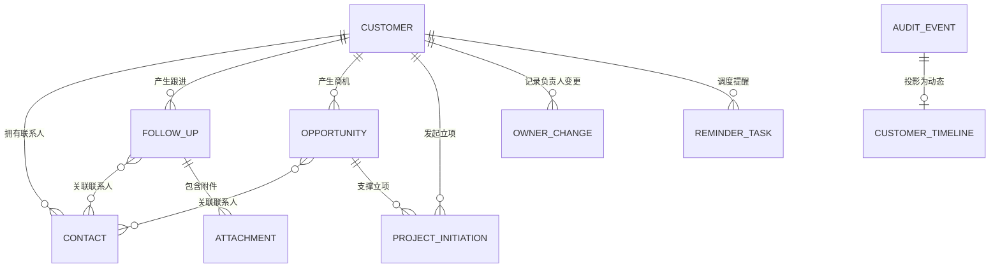

### 2.1 实体清单

| 实体 | 核心职责 | 关键字段（简） |
| --- | --- | --- |
| **客户 Customer** | 业务主数据核心 | 名称、生命周期阶段、经营状态、主负责人、跟进状态、大客户标识 |
| **联系人 Contact** | 客户对接人 | 姓名、手机号、职位、是否决策人、状态 |
| **跟进记录 FollowUp** | 客户接触留痕 | 客户、联系人、方式、时间、内容、下一次跟进计划 |
| **销售机会 Opportunity** | 商机推进 | 客户、阶段、预计金额、预计成交日、实际成交金额 |
| **项目立项 ProjectInitiation** | 钉钉审批闭环 | 客户、商机、审批实例ID、审批状态、流转快照 |
| **负责人变更 OwnerChange** | 归属流转记录 | 变更类型、原负责人、新负责人、原因 |
| **提醒任务 ReminderTask** | 跟进催办 | 客户、计划跟进时间、接收人、发送状态 |
| **附件 Attachment** | 跟进凭证 | 所属对象、文件名、存储路径、状态 |
| **审计事件 AuditEvent** | 不可变操作留痕 | 对象、操作类型、操作人、变更前后快照 |
| **客户动态 CustomerTimeline** | 审计事件的业务可读视图 | 客户、标题、摘要、操作人 |

### 2.2 组织与权限实体

| 实体 | 核心职责 |
| --- | --- |
| **组织用户 OrganizationUser** | 钉钉同步的用户、部门、在职状态 |
| **角色授权 RoleAssignment** | 用户角色与数据范围授权 |
| **跟进状态策略 FollowUpStatusPolicy** | 企业级跟进健康度阈值配置 |

## 3. 角色与权限概览

| 角色 | 数据范围 | 核心权限 |
| --- | --- | --- |
| 业务人员/主负责人 | 本人主负责或协同客户 | 新建客户、维护客户、创建跟进和商机 |
| 协同人 | 被协同授权客户 | 只读客户、新增跟进和联系人 |
| 销售主管 | 本部门及下级部门 | 分配、移交、恢复失效、查看部门统计 |
| 系统管理员 | 全部客户 | 角色、组织同步、枚举、审批模板、全量审计 |

权限判断顺序：**认证有效 → 角色具备操作权限 → 数据范围命中 → 对象经营状态允许该操作**。

## 4. 生命周期设计

### 4.1 客户生命周期阶段

描述客户关系成熟度，单向推进为主，降级需主管审批。

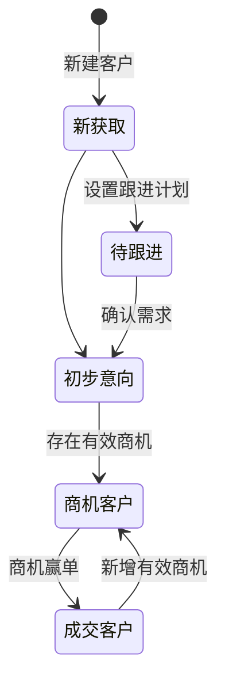

| 阶段 | 进入条件 | 可流转至 |
| --- | --- | --- |
| 新获取 | 新建客户成功 | 待跟进、初步意向 |
| 待跟进 | 已设置下一次跟进计划 | 初步意向 |
| 初步意向 | 至少一条有效跟进确认需求 | 商机客户、待跟进 |
| 商机客户 | 存在至少一条有效商机 | 成交客户、初步意向 |
| 成交客户 | 至少一条商机赢单 | 商机客户 |

### 4.2 客户经营状态

描述客户当前是否可被正常经营，与生命周期阶段独立。

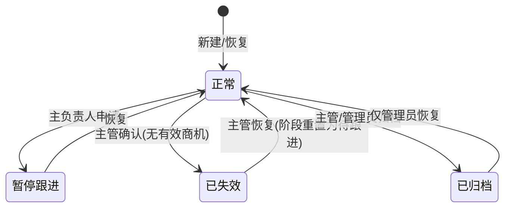

| 状态 | 可执行操作 | 退出条件 |
| --- | --- | --- |
| 正常 | 所有授权业务操作 | 可暂停、失效或归档 |
| 暂停跟进 | 查看、恢复 | 恢复为正常 |
| 已失效 | 查看、恢复、导出 | 主管恢复为正常 |
| 已归档 | 仅查看与导出 | 仅管理员恢复 |

> 暂停、失效、归档客户不得新增跟进、联系人、商机或立项；系统取消其未发送提醒。

### 4.3 商机生命周期

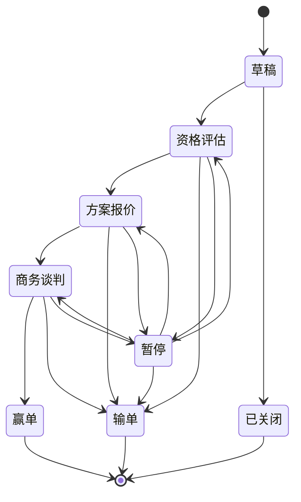

| 状态 | 可流转至 | 关键必填 |
| --- | --- | --- |
| 草稿 | 资格评估、已关闭 | 客户、商机名称、主负责人 |
| 资格评估 | 方案报价、输单、暂停 | 预计金额、预计成交日期、联系人 |
| 方案报价 | 商务谈判、输单、暂停 | 方案/报价说明 |
| 商务谈判 | 赢单、输单、暂停 | 商务进展说明 |
| 暂停 | 资格评估、方案报价、商务谈判、输单 | 暂停原因、预计恢复日期 |
| 赢单 | （终态） | 实际成交金额、赢单日期 |
| 输单 | （终态） | 输单原因、输单日期 |
| 已关闭 | （终态） | 关闭原因 |

> 有效商机 = 状态非输单/赢单的商机（资格评估、方案报价、商务谈判、暂停）。
> 大客户 = 客户存在任一有效商机预计金额 ≥ 500,000 元，系统只读计算。

### 4.4 项目立项审批生命周期

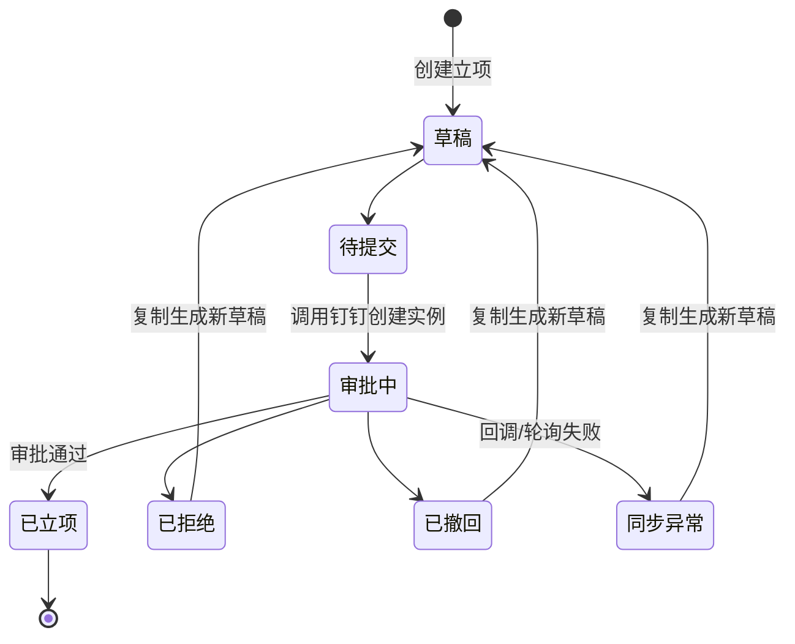

> 立项条件：客户经营状态正常 + 关联商机为商务谈判或赢单。
> 审批通过只代表"已立项"，不自动将商机置为赢单。

### 4.5 跟进提醒生命周期

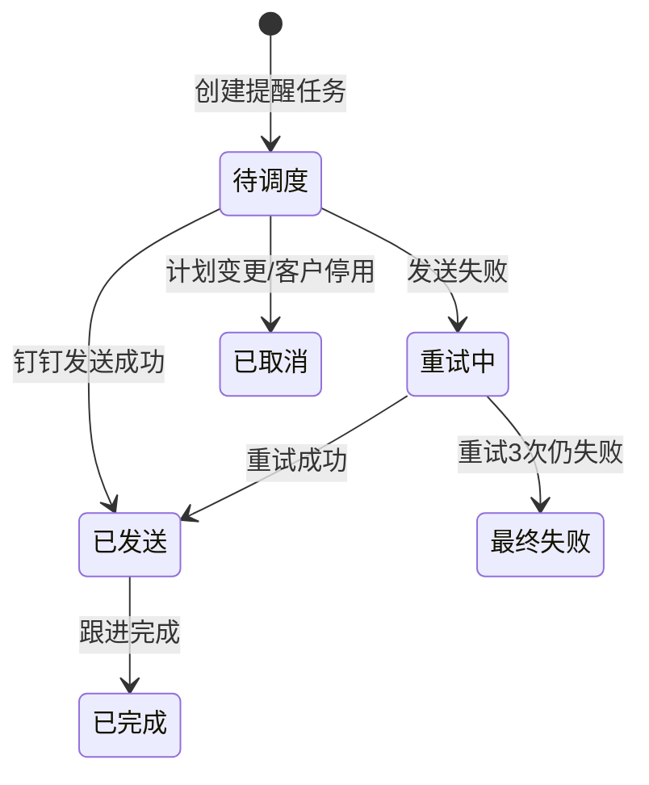

> 重试策略：5分钟、30分钟、2小时，最多3次；最终失败通知主负责人和销售主管。

### 4.6 客户跟进状态（健康度）

系统自动计算，不允许人工修改。

| 状态 | 判定规则（示例：不足7天/严重14天） |
| --- | --- |
| 正常 | 未跟进自然日数 < 不足阈值 |
| 不足 | 不足阈值 ≤ 未跟进天数 < 严重不足阈值 |
| 严重不足 | 未跟进天数 ≥ 严重不足阈值 |

> 计算基准 = 最后一次有效跟进的实际时间（非计划时间）；新客户以创建日期为基准。
> 每日 00:05 CST 批量重算正常客户；提交跟进、创建客户、策略生效时立即重算。

## 5. 核心业务流程

### 5.1 新建与维护客户

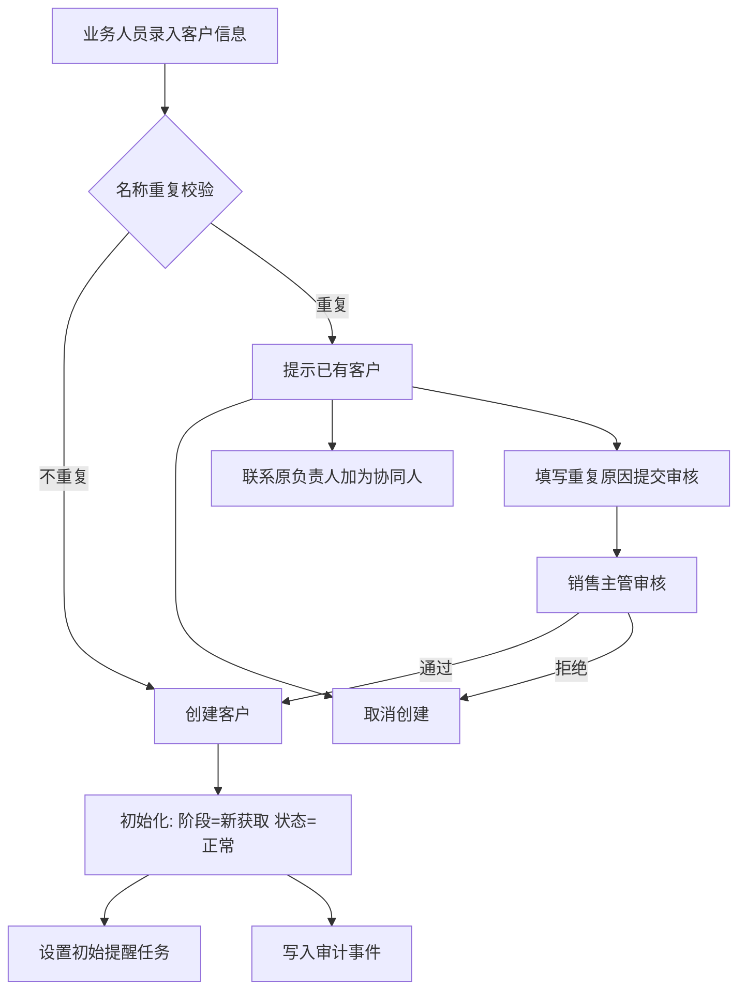

### 5.2 客户分配与移交

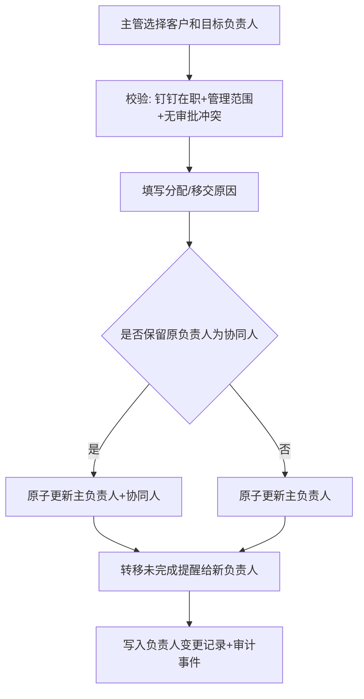

### 5.3 跟进提交与提醒联动

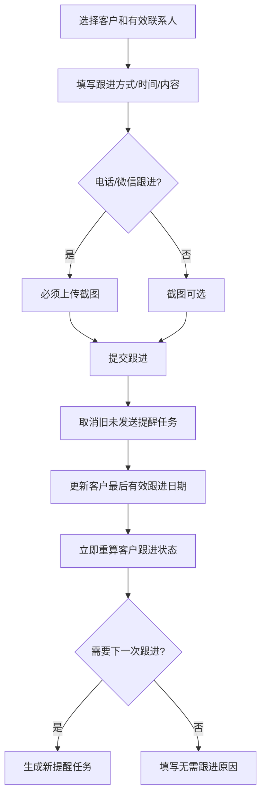

### 5.4 商机推进与客户联动

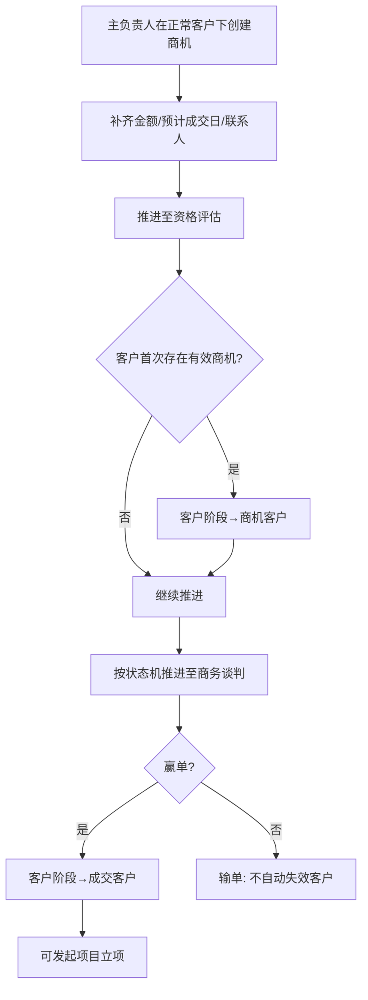

### 5.5 项目立项审批

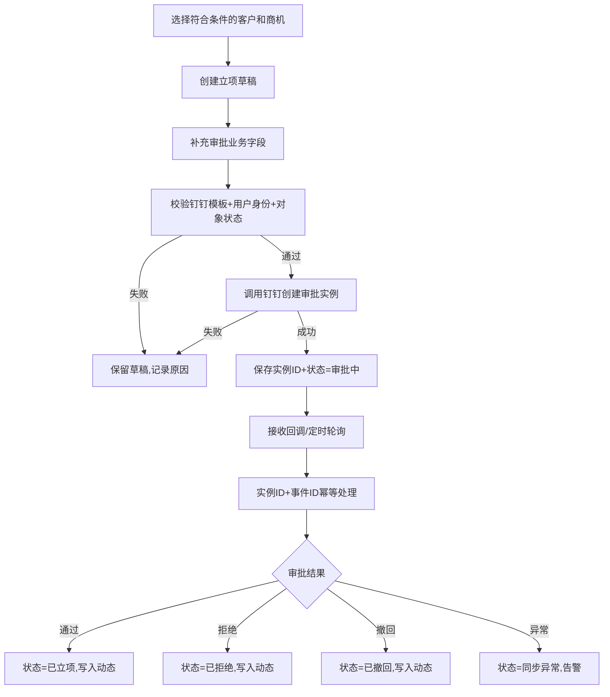

## 6. 钉钉集成要点

| 能力 | 系统行为 | 异常闭环 |
| --- | --- | --- |
| 登录 | 钉钉授权获取企业和用户身份 | 授权失败不创建会话 |
| 组织架构 | 每日全量同步部门、用户、在职状态 | 失败保留快照，告警管理员 |
| 审批 | 按模板创建审批实例，保存实例ID | 回调幂等、轮询补偿、失败告警 |
| 消息 | 根据提醒任务发送钉钉通知 | 3次退避重试，最终失败通知负责人和主管 |

## 7. 审计与数据安全

1. 新建、修改、状态流转、分配、移交、归档、恢复、导入、导出、审批同步、提醒发送均生成**不可变审计事件**。
2. 审计事件包含对象、操作类型、操作人、时间、变更前后快照、原因、请求ID。
3. 手机号、邮箱、微信号、附件按最小权限脱敏；非管理员导出手机号显示后四位。
4. 附件通过受权签名访问，禁止公共链接；预览和下载写入审计。
5. 业务主数据禁止物理删除，归档数据默认保留5年。

## 8. 后续演进

本期范围聚焦客户、跟进、商机、立项闭环。后续合同、订单、回款、开票、售后服务进入时，必须以**商机赢单、客户和立项申请**为关联起点，禁止绕过本期审计、权限和生命周期规则新建平行数据链路。
