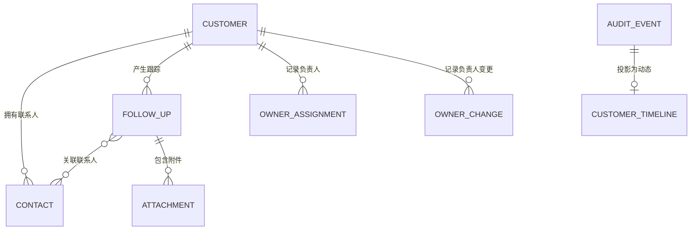
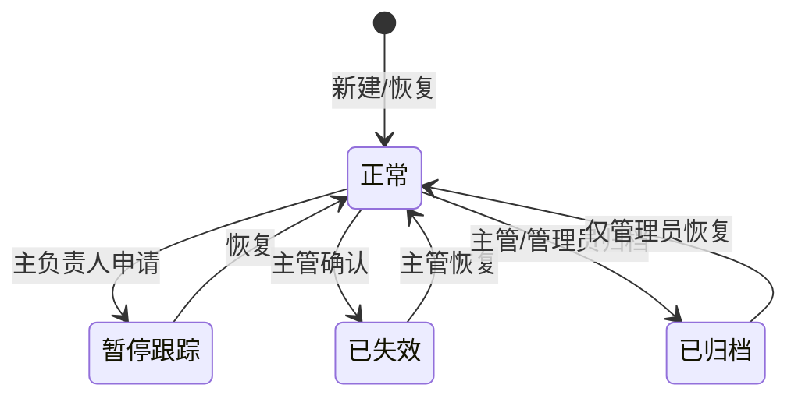
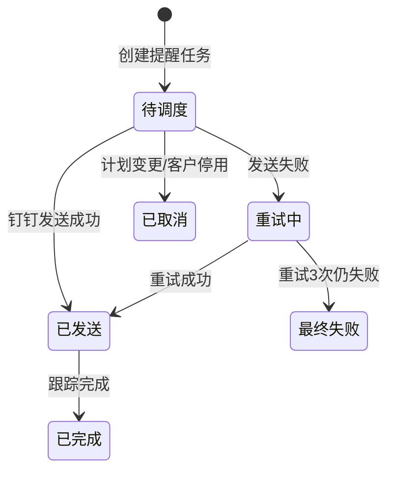
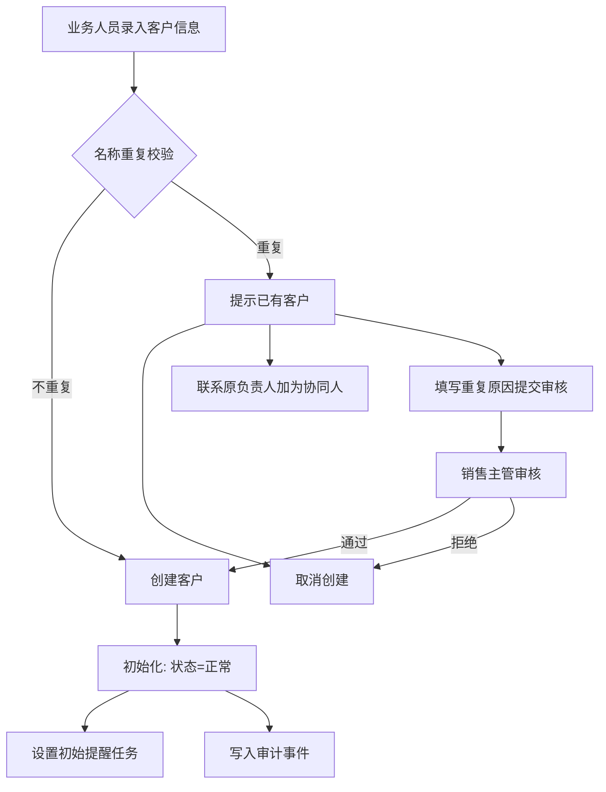
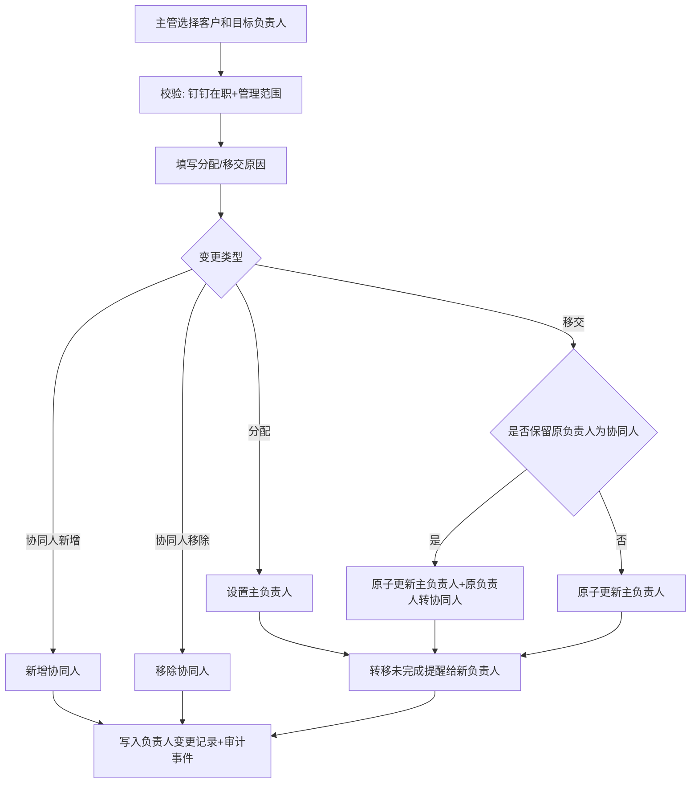
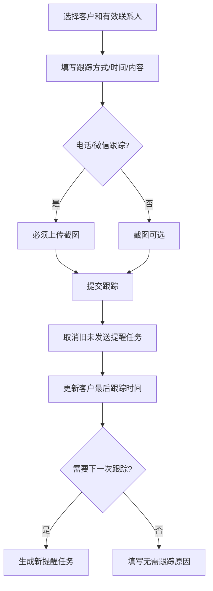

# CRM系统框架设计稿（V0.1 简化版）

> 本文档为 CRM 系统第一版简化设计，聚焦客户管理核心闭环：客户管理、客户状态管理、负责人新增与变更（多负责人）、客户跟踪。
> 后续版本在此基础上扩展商机、立项、审批等模块。

## 1. 系统定位

以客户为中心，覆盖 **客户录入 → 负责人分配 → 持续跟踪 → 状态流转** 的基础闭环。

| 项目 | 说明 |
| --- | --- |
| 终端形态 | 钉钉内 H5 及 PC 浏览器 |
| 身份认证 | 钉钉账号登录 |
| 设计原则 | 一个事实来源、状态可回溯、权限最小化、关键操作可审计 |

## 2. 核心业务实体

### 2.1 实体清单

| 实体 | 核心职责 | 关键字段（简） |
| --- | --- | --- |
| **客户 Customer** | 业务主数据核心 | 名称、客户状态、主负责人、协同人、最后跟踪时间 |
| **联系人 Contact** | 客户对接人 | 姓名、手机号、职位、状态 |
| **负责人分配 OwnerAssignment** | 记录客户与负责人的归属关系 | 客户、用户、角色（主负责人/协同人）、生效时间 |
| **负责人变更 OwnerChange** | 归属流转记录 | 客户、变更类型、原负责人、新负责人、原因 |
| **跟踪记录 FollowUp** | 客户接触留痕 | 客户、联系人、方式、时间、内容、下一次跟踪计划 |
| **附件 Attachment** | 跟踪凭证 | 所属对象、文件名、存储路径、状态 |
| **审计事件 AuditEvent** | 不可变操作留痕 | 对象、操作类型、操作人、变更前后快照 |
| **客户动态 CustomerTimeline** | 审计事件的业务可读视图 | 客户、标题、摘要、操作人 |

### 2.2 组织与权限实体

| 实体 | 核心职责 |
| --- | --- |
| **组织用户 OrganizationUser** | 钉钉同步的用户、部门、在职状态 |
| **角色授权 RoleAssignment** | 用户角色与数据范围授权 |

## 3. 角色与权限概览

| 角色 | 数据范围 | 核心权限 |
| --- | --- | --- |
| 业务人员/主负责人 | 本人主负责或协同客户 | 新建客户、维护客户、跟踪客户 |
| 协同人 | 被协同授权客户 | 只读客户、新增跟踪和联系人 |
| 销售主管 | 本部门及下级部门 | 分配、移交、恢复、查看部门统计 |
| 系统管理员 | 全部客户 | 角色、组织同步、全量审计 |

权限判断顺序：**认证有效 → 角色具备操作权限 → 数据范围命中 → 对象状态允许该操作**。

## 4. 生命周期设计

### 4.1 客户状态

描述客户当前是否可被正常经营。

| 状态 | 可执行操作 | 退出条件 |
| --- | --- | --- |
| 正常 | 所有授权业务操作 | 可暂停、失效或归档 |
| 暂停跟踪 | 查看、恢复 | 恢复为正常 |
| 已失效 | 查看、恢复、导出 | 主管恢复为正常 |
| 已归档 | 仅查看与导出 | 仅管理员恢复 |

> 暂停、失效、归档客户不得新增跟踪或联系人。

### 4.2 跟踪提醒生命周期

> 重试策略：5分钟、30分钟、2小时，最多3次；最终失败通知主负责人和销售主管。

## 5. 核心业务流程

### 5.1 新建与维护客户

### 5.2 负责人新增与变更（多负责人）

支持一名主负责人 + 零到多名协同人。负责人变更是独立业务记录，不覆盖历史。

**负责人分配 OwnerAssignment**

| 字段 | 类型 | 必填 | 说明 |
| --- | --- | --- | --- |
| assignmentId | string | 是 | 分配唯一ID |
| customerId | string | 是 | 关联客户 |
| userId | string | 是 | 负责人用户ID |
| role | enum | 是 | 主负责人、协同人 |
| effectiveFrom | datetime | 是 | 生效时间 |
| effectiveTo | datetime | 否 | 失效时间 |
| status | enum | 是 | 有效、已失效 |
| assignedBy | UserRef | 是 | 操作人 |

**负责人变更 OwnerChange**

| 字段 | 类型 | 必填 | 说明 |
| --- | --- | --- | --- |
| ownerChangeId | string | 是 | 变更唯一ID |
| customerId | string | 是 | 关联客户 |
| changeType | enum | 是 | 分配、移交、协同人新增、协同人移除 |
| previousPrimaryOwner | UserRef | 否 | 原主负责人 |
| targetPrimaryOwner | UserRef | 否 | 新主负责人 |
| addedCollaboratorIds | array[string] | 否 | 新增协同人 |
| removedCollaboratorIds | array[string] | 否 | 移除协同人 |
| keepPreviousOwnerAsCollaborator | boolean | 是 | 移交时是否保留原负责人为协同人 |
| effectiveAt | datetime | 是 | 生效时间 |
| reason | string | 是 | 变更原因 |
| operator | UserRef | 是 | 操作人 |

### 5.3 客户跟踪与提醒联动

**跟踪记录 FollowUp**

| 字段 | 类型 | 必填 | 说明 |
| --- | --- | --- | --- |
| followUpId | string | 是 | 跟踪记录唯一ID |
| customerId | string | 是 | 关联客户 |
| contactIds | array[string] | 是 | 至少一个有效联系人 |
| method | enum | 是 | 电话、面谈、微信 |
| followUpAt | datetime | 是 | 发生时间，不得晚于当前时间 |
| content | text | 是 | 跟踪内容 |
| outcome | string | 否 | 本次跟踪结果摘要 |
| nextAction | string | 否 | 下一步行动说明 |
| nextFollowUpAt | datetime | 条件必填 | 正常客户提交跟踪时必填 |
| noNextFollowUpReason | string | 条件必填 | 无下一次跟踪计划时必填 |
| createdBy | UserRef | 是 | 创建人 |

## 6. 钉钉集成要点

| 能力 | 系统行为 | 异常闭环 |
| --- | --- | --- |
| 登录 | 钉钉授权获取企业和用户身份 | 授权失败不创建会话 |
| 组织架构 | 每日全量同步部门、用户、在职状态 | 失败保留快照，告警管理员 |
| 消息 | 根据提醒任务发送钉钉通知 | 3次退避重试，最终失败通知负责人和主管 |

## 7. 审计与数据安全

1. 新建、修改、状态流转、分配、移交、归档、恢复、跟踪、提醒发送均生成**不可变审计事件**。
2. 审计事件包含对象、操作类型、操作人、时间、变更前后快照、原因、请求ID。
3. 手机号、邮箱、微信号、附件按最小权限脱敏。
4. 附件通过受权签名访问，禁止公共链接；预览和下载写入审计。
5. 业务主数据禁止物理删除，归档数据默认保留5年。

## 8. 后续演进

第一版聚焦客户管理、状态管理、负责人变更和客户跟踪闭环。后续商机、立项、审批、合同、订单等模块进入时，必须以**客户和负责人分配**为关联起点，禁止绕过本期审计、权限和状态规则新建平行数据链路。
