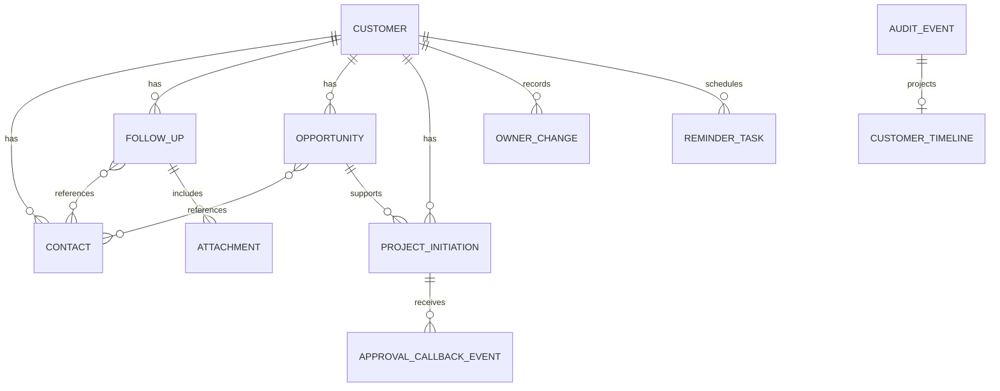

# CRM业务实体与数据字典（V1.0 业务闭环设计稿）

> 本文档为 [需求说明.md](需求说明.md) 的数据落地基线。所有业务主表均应包含内部唯一ID、创建时间、创建人、更新时间、更新人和版本号；时间统一以UTC存储、中国标准时间展示，金额统一以元和decimal存储。

## 1. 通用数据规则

| 规则 | 定义 |
| --- | --- |
| 主键 | 所有业务实体使用系统生成的全局唯一ID，不以姓名、手机号或钉钉用户ID作为主键 |
| 逻辑删除 | 本期业务主数据不物理删除；使用状态字段表达停用、失效或归档 |
| 乐观锁 | 可编辑主数据包含版本号；版本不一致时拒绝覆盖并要求刷新后重试 |
| 组织归属 | 所有客户数据保存企业ID、创建部门ID和当前主负责人部门ID，用于数据范围判定 |
| 操作审计 | 关键变更必须写入AuditEvent；业务动态由AuditEvent投影生成 |
| 枚举 | 本文定义的状态枚举为冻结枚举；新增或变更须经过需求评审 |
| 敏感数据 | 手机号、邮箱、微信号、附件访问地址和外部接口凭据不得直接写入普通操作日志 |

## 2. 组织、用户与权限

### 2.1 组织用户 OrganizationUser

| 字段 | 类型 | 必填 | 说明 |
| --- | --- | --- | --- |
| userId | string | 是 | 系统内部用户ID |
| enterpriseId | string | 是 | 钉钉企业或租户标识 |
| dingTalkUserId | string | 是 | 钉钉企业内用户唯一标识 |
| name | string | 是 | 当前姓名 |
| departmentIds | array[string] | 是 | 当前所属部门ID集合 |
| title | string | 否 | 当前职位 |
| employmentStatus | enum | 是 | 在职、离职、停用 |
| lastSyncedAt | datetime | 是 | 最近一次组织同步时间 |

约束：`enterpriseId + dingTalkUserId`唯一。离职和停用用户不得被新选为主负责人、协同人或提醒接收人，但必须保留其历史UserRef快照。

### 2.2 角色授权 RoleAssignment

| 字段 | 类型 | 必填 | 说明 |
| --- | --- | --- | --- |
| roleAssignmentId | string | 是 | 授权唯一ID |
| userId | string | 是 | 授权用户 |
| roleCode | enum | 是 | 业务人员、销售主管、系统管理员 |
| scopeType | enum | 是 | 本人、部门及下级部门、全部 |
| scopeDepartmentId | string | 条件必填 | 部门范围授权时必填 |
| effectiveFrom | datetime | 是 | 生效时间 |
| effectiveTo | datetime | 否 | 失效时间 |
| status | enum | 是 | 有效、已撤销 |
| grantedBy | UserRef | 是 | 授权人 |

权限判断以有效RoleAssignment和当前OrganizationUser组织归属为准；主负责人和协同人是对象级数据授权，不替代角色授权。

### 2.3 用户引用 UserRef

`UserRef` 用于关联钉钉用户，不作为权限判断的唯一来源；权限判断以当前组织同步数据和角色授权为准。

| 字段 | 类型 | 必填 | 说明 |
| --- | --- | --- |
| userId | string | 是 | 系统内部用户ID |
| dingTalkUserId | string | 是 | 钉钉企业内用户唯一标识 |
| nameSnapshot | string | 是 | 关联时保存的姓名快照 |
| departmentIdSnapshot | string | 否 | 关联时保存的部门ID快照 |
| departmentNameSnapshot | string | 否 | 关联时保存的部门名称快照 |
| titleSnapshot | string | 否 | 关联时保存的职位快照 |
| activeAtReference | boolean | 是 | 建立关联时是否在职 |

## 3. 客户 Customer

### 3.1 字段定义

| 字段 | 类型 | 必填 | 说明 |
| --- | --- | --- | --- |
| customerId | string | 是 | 客户唯一ID |
| customerCode | string | 是 | 系统生成的客户编码，不可修改 |
| enterpriseId | string | 是 | 钉钉企业或租户标识 |
| name | string | 是 | 客户名称，去首尾空格后参与重复校验 |
| normalizedName | string | 是 | 规范化名称，用于重复识别，不直接展示 |
| addressProvince | string | 是 | 省/直辖市 |
| addressCity | string | 是 | 市/区县 |
| addressDistrict | string | 否 | 区/县 |
| addressStreet | string | 否 | 街道/园区 |
| addressDetail | string | 是 | 详细地址 |
| tags | array[string] | 否 | 客户标签，可多选，值来自标签配置 |
| lifecycleStage | enum | 是 | 新获取、待跟进、初步意向、商机客户、成交客户 |
| operatingStatus | enum | 是 | 正常、暂停跟进、已失效、已归档 |
| stageChangeReason | string | 条件必填 | 阶段降级时必填 |
| statusChangeReason | string | 条件必填 | 暂停、失效、归档、恢复时必填 |
| plannedResumeAt | datetime | 条件必填 | 暂停跟进时必填的计划恢复时间 |
| importance | enum | 是 | 一般、重要、非常重要 |
| source | enum | 是 | 公司资源、客户转介绍、客户主动介绍、网络渠道、自主开拓、其他 |
| industry | enum | 是 | 公交、汽渡、航道、船舶、园区（政府）、私企、其他 |
| remark | text | 否 | 客户补充说明 |
| primaryOwner | UserRef | 是 | 唯一主负责人 |
| collaboratorIds | array[string] | 否 | 协同人用户ID；不得包含主负责人且不得重复 |
| creatorDepartmentId | string | 是 | 创建时部门ID |
| ownerDepartmentId | string | 是 | 当前主负责人部门ID |
| nextFollowUpAt | datetime | 是 | 当前下一次跟进时间；暂停、失效和归档后允许为空 |
| lastEffectiveFollowUpAt | datetime | 否 | 最近一次有效跟进的实际发生时间；尚无有效跟进时为空 |
| daysWithoutFollowUp | integer | 是 | 当前未跟进自然日数；系统按中国标准时间计算，只读 |
| followUpStatus | enum | 是 | 正常、不足、严重不足；系统计算，只读 |
| followUpStatusChangedAt | datetime | 是 | 最近一次跟进状态变化时间 |
| followUpStatusPolicyId | string | 是 | 最近一次计算采用的跟进状态策略ID |
| isKeyAccount | boolean | 是 | 根据有效商机预计金额计算，只读 |
| archivedAt | datetime | 否 | 归档时间 |

### 3.2 约束

1. `normalizedName + enterpriseId` 对经营状态非已归档客户必须唯一；例外创建需记录重复原因和审核审计事件。
2. 正常客户必须有`nextFollowUpAt`；暂停、失效、归档客户的未发送提醒任务必须取消。提醒计划不得作为`followUpStatus`的计算依据。
3. 正常或暂停客户的`lifecycleStage = 商机客户`时必须至少存在一条有效商机；`lifecycleStage = 成交客户`时必须至少存在一条赢单商机。已失效和已归档客户保留失效或归档前最后阶段快照。
4. `operatingStatus = 已失效`或`已归档`时，不得存在有效商机或审批中的项目立项申请。
5. 客户禁止物理删除；归档后所有编辑入口关闭，仅管理员可恢复。

### 3.3 重复客户创建申请 DuplicateCustomerRequest

| 字段 | 类型 | 必填 | 说明 |
| --- | --- | --- | --- |
| duplicateRequestId | string | 是 | 申请唯一ID |
| enterpriseId | string | 是 | 企业或租户标识 |
| proposedCustomerSnapshot | object | 是 | 待创建客户的字段快照 |
| matchedCustomerIds | array[string] | 是 | 规则命中的已有客户ID |
| duplicateReason | string | 是 | 申请人说明为何需要重复创建 |
| status | enum | 是 | 待审核、已通过、已拒绝、已创建、已取消 |
| requester | UserRef | 是 | 申请人 |
| reviewer | UserRef | 否 | 销售主管或系统管理员 |
| reviewComment | string | 否 | 审核意见 |
| createdCustomerId | string | 否 | 审核通过后实际创建的客户ID |

约束：仅审核通过的申请可创建同名正常客户；一份申请最多创建一个客户；审核和创建均写入AuditEvent。

### 3.4 客户跟进状态策略 FollowUpStatusPolicy

| 字段 | 类型 | 必填 | 说明 |
| --- | --- | --- | --- |
| policyId | string | 是 | 跟进状态策略唯一ID |
| enterpriseId | string | 是 | 策略所属企业或租户 |
| insufficientAfterDays | integer | 是 | 不足阈值天数，未跟进自然日数达到该值即为不足 |
| severeAfterDays | integer | 是 | 严重不足阈值天数，未跟进自然日数达到该值即为严重不足 |
| effectiveAt | datetime | 是 | 策略生效时间，使用中国标准时间配置 |
| status | enum | 是 | 草稿、待生效、生效中、已失效 |
| impactPreview | object | 否 | 发布前计算的正常、不足、严重不足客户数量变化 |
| publishedBy | UserRef | 否 | 发布策略的系统管理员 |
| publishedAt | datetime | 否 | 发布操作时间 |

约束：同一企业在任一时点只能有一条生效中策略；`1 <= insufficientAfterDays < severeAfterDays <= 365`。客户模块启用前必须存在一条已生效策略。策略到达生效时间时，系统对所有经营状态为正常的客户全量重算`daysWithoutFollowUp`和`followUpStatus`，并将策略ID记录到客户和AuditEvent中。

## 4. 联系人 Contact

| 字段 | 类型 | 必填 | 说明 |
| --- | --- | --- | --- |
| contactId | string | 是 | 联系人唯一ID |
| customerId | string | 是 | 归属客户ID；一个联系人仅归属一个客户 |
| name | string | 是 | 联系人姓名 |
| phoneType | enum | 是 | 手机、座机、其他 |
| countryCode | string | 否 | 国际区号，默认+86 |
| phoneNumber | string | 是 | 规范化后的号码，展示时脱敏 |
| email | string | 否 | 邮箱，展示和导出时按权限脱敏 |
| wechatId | string | 否 | 微信号，展示和导出时按权限脱敏 |
| responsibility | string | 否 | 分管内容 |
| title | string | 否 | 职位 |
| isDecisionMaker | boolean | 是 | 是否决策人，默认否 |
| remark | text | 否 | 备注 |
| status | enum | 是 | 有效、已停用 |

约束：同一客户下规范化后的手机号不得重复；已被跟进、商机或审批快照引用的联系人只能停用，不得删除；停用联系人不可用于新跟进或新商机。

## 5. 客户负责人变更 OwnerChange

负责人变更是独立业务记录，不能只依赖客户当前字段覆盖历史。

| 字段 | 类型 | 必填 | 说明 |
| --- | --- | --- | --- |
| ownerChangeId | string | 是 | 变更唯一ID |
| customerId | string | 是 | 关联客户 |
| changeType | enum | 是 | 分配、移交、协同人新增、协同人移除 |
| previousPrimaryOwner | UserRef | 否 | 原主负责人；首次分配可为空 |
| targetPrimaryOwner | UserRef | 否 | 新主负责人；协同人操作可为空 |
| addedCollaboratorIds | array[string] | 否 | 新增协同人 |
| removedCollaboratorIds | array[string] | 否 | 移除协同人 |
| keepPreviousOwnerAsCollaborator | boolean | 是 | 移交时是否保留原负责人为协同人 |
| effectiveAt | datetime | 是 | 生效时间 |
| reason | string | 是 | 分配、移交或移除原因 |
| operator | UserRef | 是 | 销售主管或管理员 |

## 6. 跟进记录 FollowUp

| 字段 | 类型 | 必填 | 说明 |
| --- | --- | --- | --- |
| followUpId | string | 是 | 跟进记录唯一ID |
| customerId | string | 是 | 关联客户 |
| contactIds | array[string] | 是 | 至少一个当前客户的有效联系人 |
| method | enum | 是 | 电话、面谈、微信 |
| followUpAt | datetime | 是 | 发生时间，不得晚于当前时间 |
| content | text | 是 | 跟进内容 |
| hasNewSigningProject | boolean | 是 | 是否跟进新签项目 |
| outcome | string | 否 | 本次跟进结果摘要 |
| nextAction | string | 否 | 下一步行动说明 |
| nextFollowUpAt | datetime | 条件必填 | 正常客户提交有效跟进时必填 |
| noNextFollowUpReason | string | 条件必填 | 无下一次跟进计划时必填，仅暂停、失效、归档客户允许 |
| correctionOfFollowUpId | string | 否 | 更正记录引用的原跟进ID |
| correctionReason | string | 条件必填 | 更正记录时必填 |
| createdBy | UserRef | 是 | 创建人 |
| immutableAt | datetime | 是 | 提交完成时间，之后正文不可直接更新 |

约束：跟进时间允许补录最近30个自然日；超过30日仅销售主管或管理员可补录且必须填写原因。保存新联系人和跟进记录时必须使用同一事务。电话、微信跟进必须关联至少一个附件。成功提交的跟进记录按其`followUpAt`参与客户最后有效跟进日期计算；更正记录只采用更正后的实际跟进时间，不以其创建时间刷新客户跟进状态。

## 7. 提醒任务 ReminderTask

| 字段 | 类型 | 必填 | 说明 |
| --- | --- | --- | --- |
| reminderTaskId | string | 是 | 提醒任务唯一ID |
| customerId | string | 是 | 关联客户 |
| sourceFollowUpId | string | 否 | 来源跟进记录；客户首次创建时可为空 |
| planKey | string | 是 | 同一跟进计划的幂等标识 |
| plannedFollowUpAt | datetime | 是 | 对应下一次跟进时间 |
| scheduledAt | datetime | 是 | 发送时间，默认为前1日09:00 CST；若该时点已过则为任务创建时刻 |
| recipientUserId | string | 是 | 单个提醒接收人；主负责人必有一条任务，可为协同人分别创建任务 |
| status | enum | 是 | 待调度、重试中、已发送、已完成、已取消、最终失败 |
| retryCount | integer | 是 | 已执行重试次数，最大3 |
| lastAttemptAt | datetime | 否 | 最近一次发送尝试时间 |
| lastErrorCode | string | 否 | 脱敏后的最近失败码 |
| completedAt | datetime | 否 | 对应跟进完成或人工完成时间 |

唯一约束：`customerId + planKey + recipientUserId + status(待调度/重试中)`只能存在一条有效发送记录。客户经营状态变更、跟进计划修改或新跟进提交时必须取消旧未发送任务。

## 8. 附件 Attachment

| 字段 | 类型 | 必填 | 说明 |
| --- | --- | --- | --- |
| attachmentId | string | 是 | 附件唯一ID |
| ownerType | enum | 是 | 跟进记录、审批申请、客户 |
| ownerId | string | 是 | 所属业务对象ID |
| fileName | string | 是 | 原始文件名 |
| contentType | string | 是 | 文件MIME类型 |
| sizeBytes | integer | 是 | 文件字节数 |
| storageKey | string | 是 | 私有对象存储路径，不直接暴露 |
| checksum | string | 是 | 文件完整性校验值 |
| uploadedBy | UserRef | 是 | 上传人 |
| uploadedAt | datetime | 是 | 上传时间 |
| status | enum | 是 | 待扫描、可用、隔离、已删除 |

约束：电话和微信跟进至少关联一条`status = 可用`的图片附件；附件预览、下载和删除均写入审计事件；禁止公共访问链接。

## 9. 销售机会 Opportunity

| 字段 | 类型 | 必填 | 说明 |
| --- | --- | --- | --- |
| opportunityId | string | 是 | 商机唯一ID |
| opportunityCode | string | 是 | 系统生成的商机编码 |
| customerId | string | 是 | 关联正常客户 |
| name | string | 是 | 商机名称 |
| primaryOwner | UserRef | 是 | 默认继承客户主负责人 |
| contactIds | array[string] | 条件必填 | 进入资格评估前至少一名有效联系人 |
| source | enum | 否 | 公司资源、客户转介绍、客户主动介绍、网络渠道、自主开拓、其他 |
| type | enum | 是 | 新签、续约、增购、其他 |
| stage | enum | 是 | 草稿、资格评估、方案报价、商务谈判、暂停、赢单、输单、已关闭 |
| expectedAmount | decimal | 条件必填 | 进入资格评估前必填，单位元，大于0 |
| expectedCloseDate | date | 条件必填 | 进入资格评估前必填，不得早于创建日期 |
| probability | integer | 是 | 0至100；各阶段默认值由后台配置 |
| stageNote | text | 否 | 当前阶段说明 |
| quotationSummary | text | 条件必填 | 进入方案报价前必填 |
| negotiationSummary | text | 条件必填 | 进入商务谈判前必填 |
| pausedReason | string | 条件必填 | 暂停时必填 |
| resumeDate | date | 条件必填 | 暂停时必填 |
| actualAmount | decimal | 条件必填 | 赢单时必填，单位元，大于等于0 |
| wonAt | datetime | 条件必填 | 赢单时必填 |
| lostReason | enum | 条件必填 | 输单时必填：预算不足、竞品中标、需求取消、时机不符、其他 |
| lostAt | datetime | 条件必填 | 输单时必填 |
| closedReason | string | 条件必填 | 草稿关闭时必填 |

约束：赢单、输单和已关闭为终态；终态不允许编辑业务字段。有效商机指资格评估、方案报价、商务谈判或暂停状态。`isKeyAccount`根据客户全部有效商机的`expectedAmount`实时计算。

## 10. 项目立项申请 ProjectInitiation

| 字段 | 类型 | 必填 | 说明 |
| --- | --- | --- | --- |
| initiationId | string | 是 | 申请唯一ID |
| customerId | string | 是 | 关联正常客户 |
| opportunityId | string | 是 | 关联商务谈判或赢单商机 |
| title | string | 是 | 立项申请标题 |
| applicant | UserRef | 是 | 发起申请人，默认商机主负责人 |
| status | enum | 是 | 草稿、待提交、审批中、已立项、已拒绝、已撤回、同步异常 |
| dingTalkProcessCode | string | 条件必填 | 钉钉审批模板标识，提交后必填 |
| dingTalkProcessInstanceId | string | 条件必填 | 钉钉审批实例唯一ID，创建实例成功后必填且唯一 |
| submittedAt | datetime | 否 | 成功提交时间 |
| completedAt | datetime | 否 | 审批终态时间 |
| approvalSnapshot | object | 否 | 最近一次审批流转快照 |
| lastSyncAt | datetime | 否 | 最近同步时间 |
| syncFailureReason | string | 否 | 同步异常时的脱敏失败原因 |
| sourcePayloadSnapshot | object | 是 | 发起时审批业务字段快照 |

约束：同一客户和商机在审批中状态仅允许一条立项申请。审批模板标识不等同于审批实例ID，二者必须同时保存。回调以`dingTalkProcessInstanceId + callbackEventId`去重。

## 11. 审批回调事件 ApprovalCallbackEvent

| 字段 | 类型 | 必填 | 说明 |
| --- | --- | --- | --- |
| callbackEventId | string | 是 | 外部事件唯一标识，用于幂等去重 |
| processInstanceId | string | 是 | 钉钉审批实例ID |
| receivedAt | datetime | 是 | 接收时间 |
| signatureVerified | boolean | 是 | 回调签名是否验证通过 |
| payloadSnapshot | object | 是 | 脱敏后的原始回调快照 |
| handledStatus | enum | 是 | 待处理、已处理、忽略、处理失败 |
| handledAt | datetime | 否 | 处理完成时间 |
| failureReason | string | 否 | 处理失败原因 |

## 12. 审计事件 AuditEvent 与客户动态 CustomerTimeline

### 12.1 审计事件

| 字段 | 类型 | 必填 | 说明 |
| --- | --- | --- | --- |
| auditEventId | string | 是 | 审计事件唯一ID |
| enterpriseId | string | 是 | 企业/租户标识 |
| entityType | enum | 是 | 客户、联系人、跟进、商机、立项申请、提醒、附件、权限、导入、导出 |
| entityId | string | 是 | 对应业务对象ID |
| action | enum | 是 | 创建、更新、状态变更、分配、移交、归档、恢复、停用、导入、导出、发送、重试、取消、回调同步 |
| operator | UserRef | 否 | 操作用户；系统任务或外部回调可为空 |
| occurredAt | datetime | 是 | 发生时间 |
| reason | string | 否 | 业务原因 |
| beforeSnapshot | object | 否 | 脱敏后的变更前快照 |
| afterSnapshot | object | 否 | 脱敏后的变更后快照 |
| requestId | string | 是 | 请求或任务唯一标识 |
| source | enum | 是 | H5、后台、定时任务、钉钉回调、数据导入 |

审计事件只允许新增，不允许更新或删除。

### 12.2 客户动态

| 字段 | 类型 | 必填 | 说明 |
| --- | --- | --- | --- |
| timelineId | string | 是 | 动态唯一ID |
| customerId | string | 是 | 关联客户 |
| auditEventId | string | 是 | 对应审计事件ID |
| title | enum | 是 | 新建客户、客户信息更新、新增联系人、联系人停用、新增跟进、跟进更正、客户跟进状态变更、商机状态变更、客户分配、客户移交、客户失效、客户归档、客户恢复、项目立项提交、项目立项完成、项目立项拒绝、提醒发送失败 |
| content | text | 是 | 面向业务人员的可读摘要 |
| operator | UserRef | 否 | 操作人或系统任务发起人 |
| occurredAt | datetime | 是 | 发生时间 |

## 13. 实体关系

## 14. 数据完整性与保留规则

1. 所有关联外键必须校验目标对象存在、归属一致且状态允许引用。
2. 客户归档、联系人停用、商机终态和审批终态均保留历史引用，不允许级联物理删除。
3. 导入、接口回调、提醒发送和状态变更均须具备幂等键，重复请求不得重复创建业务对象或动态。
4. 附件保存前须完成类型、大小、病毒扫描和完整性校验；隔离附件不得在页面展示。
5. 数据展示和导出按权限进行字段脱敏；手机号默认显示后四位，邮箱和微信号按角色策略展示。
6. 已归档客户及其关联业务数据保留5年；审计事件保留期限不得短于关联业务数据。
