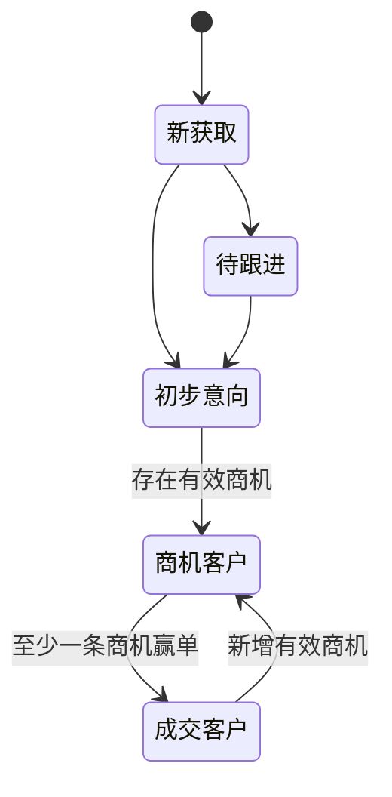

# CRM系统需求说明（V1.0 业务闭环设计稿）

## 1. 文档信息

| 项目 | 内容 |
| --- | --- |
| 文档状态 | 业务设计基线，进入详细设计前评审 |
| 适用范围 | CRM系统及配套后台管理系统 |
| 终端形态 | 钉钉内H5及PC浏览器 |
| 身份认证 | 钉钉账号登录 |
| 关联文档 | [业务实体.md](业务实体.md) |
| 设计原则 | 一个事实来源、状态可回溯、权限最小化、关键操作可审计 |

本文档将第一阶段的模糊项收敛为可开发规则。任何修改本文件中已冻结的状态、权限、数据约束或流程条件，均须通过需求变更评审，不允许由研发在实现时自行解释。

## 2. 建设目标与范围

### 2.1 建设目标

以客户为中心，覆盖从客户获取、负责人分配、持续跟进、商机推进、项目立项到成交后的客户维护全过程；所有关键动作必须可定位到操作人、操作时间、业务对象和变更结果。

### 2.2 本期范围

1. 客户、联系人、负责人和协同人管理。
2. 客户跟进、待办提醒和客户跟进状态管理。
3. 销售机会及销售阶段管理。
4. 钉钉项目立项审批发起、状态同步和流转查看。
5. 角色、数据权限、组织架构同步、操作审计和基础统计。

### 2.3 非本期范围

合同、订单、回款、开票、售后服务、营销活动和独立项目管理不属于本期交付范围。项目立项申请仅负责钉钉审批闭环，不替代项目管理系统。

## 3. 二次分析结论与设计决策

| 原风险 | 设计决策 | 闭环规则 |
| --- | --- | --- |
| 客户跟进状态与客户状态语义重叠 | 拆分为“客户生命周期阶段”和“客户经营状态” | 阶段描述客户关系成熟度；经营状态描述是否允许继续经营，两者独立但有联动约束 |
| 多负责人、协同人和数据权限不明确 | 设定一名主负责人、零到多名协同人，并建立角色和数据范围矩阵 | 所有读取和写入均先校验角色权限与对象归属 |
| 删除会破坏历史记录 | 禁止物理删除客户、联系人、跟进、商机和审批数据 | 仅允许归档或逻辑停用；历史记录和附件永久关联原对象 |
| 商机状态和大客户口径不明确 | 冻结商机状态机及大客户计算规则 | 大客户由有效商机预计金额计算，不允许手工改写结论 |
| 审批只保存表单ID | 同时保存审批模板标识、审批实例ID、状态、回调事件和流转快照 | 回调以实例ID和事件ID幂等处理，失败进入补偿队列 |
| 提醒没有发送与失败闭环 | 将提醒建模为独立任务 | 每次编辑重建任务；发送、失败、重试、取消均有状态和审计记录 |
| 客户动态不足以审计 | 客户动态展示审计事件投影 | 关键操作写入不可变审计事件，动态只是面向业务人员的可读视图 |

## 4. 术语、角色与权限

### 4.1 业务术语

| 术语 | 定义 |
| --- | --- |
| 主负责人 | 客户当前唯一责任人，决定客户的主数据归属和默认提醒接收人 |
| 协同人 | 获得客户只读及新增跟进/联系人权限的协作人员，不拥有分配、移交和归档权限 |
| 客户生命周期阶段 | 客户关系成熟度：新获取、待跟进、初步意向、商机客户、成交客户 |
| 客户经营状态 | 当前客户是否可被正常经营：正常、暂停跟进、已失效、已归档 |
| 客户跟进状态 | 基于最后有效跟进日期自动计算：正常、不足、严重不足；用于识别长期未跟进客户 |
| 有效商机 | 状态不是输单或赢单的商机，即资格评估、方案报价、商务谈判或暂停中的商机 |
| 大客户 | 当前客户存在至少一条预计金额大于等于500,000元的有效商机 |
| 客户动态 | 审计事件的业务可读展示，不是允许手工修改的独立记录 |

### 4.2 角色定义

| 角色 | 数据范围 | 主要权限 |
| --- | --- | --- |
| 业务人员 | 本人主负责或协同的客户 | 新建客户、维护本人主负责客户、维护联系人、创建跟进和商机 |
| 主负责人 | 当前主负责的客户 | 维护客户和商机、管理协同人、设置提醒、查看所有关联记录 |
| 协同人 | 被协同授权的客户 | 查看客户、创建跟进和联系人；不可修改客户核心字段、商机、负责人或协同人 |
| 销售主管 | 本部门及下级部门客户 | 分配、移交、恢复已失效客户、查看部门统计与导出部门数据 |
| 系统管理员 | 全部客户 | 角色、组织同步、枚举、审批模板、通知策略、全量审计和全量导出 |

### 4.3 权限矩阵

| 操作 | 业务人员/主负责人 | 协同人 | 销售主管 | 系统管理员 |
| --- | --- | --- | --- |
| 新建客户 | 可，新建后本人自动成为主负责人 | 不可 | 可 | 可 |
| 查看客户 | 本人主负责或协同 | 被协同客户 | 部门范围 | 全部 |
| 编辑客户核心字段 | 仅主负责人 | 不可 | 部门范围 | 全部 |
| 新增联系人/跟进 | 本人主负责客户 | 被协同客户 | 部门范围 | 全部 |
| 新增/编辑商机 | 仅主负责人 | 不可 | 部门范围 | 全部 |
| 增减协同人 | 仅主负责人 | 不可 | 部门范围 | 全部 |
| 分配/移交主负责人 | 不可 | 不可 | 部门范围 | 全部 |
| 暂停、恢复暂停、失效、归档、恢复已失效客户 | 主负责人仅可暂停和恢复暂停 | 不可 | 部门范围 | 全部 |
| 导出 | 仅本人主负责数据，字段脱敏 | 不可 | 部门范围，字段脱敏 | 全量，字段脱敏 |

权限判断顺序为：认证有效 -> 角色具备操作权限 -> 数据范围命中 -> 对象经营状态允许该操作。任何一步不满足时，接口返回无权限或状态不允许，不返回对象敏感字段。

## 5. 生命周期与状态机

### 5.1 客户生命周期阶段

| 阶段 | 进入条件 | 允许流转 | 说明 |
| --- | --- | --- | --- |
| 新获取 | 新建客户成功 | 待跟进、初步意向 | 尚未完成有效接触 |
| 待跟进 | 已设置下一次跟进计划 | 初步意向 | 存在明确待办，但尚未确认需求 |
| 初步意向 | 至少一条有效跟进记录明确客户需求 | 商机客户、待跟进 | 已确认初步需求或采购意向 |
| 商机客户 | 存在至少一条有效商机 | 成交客户、初步意向 | 正在推进明确商业机会 |
| 成交客户 | 至少一条商机赢单 | 商机客户 | 已产生至少一次成交；再次出现有效商机时仍可保持成交客户 |

“已失效”不再作为生命周期阶段，而是客户经营状态。客户失效时保留最后生命周期阶段作为历史快照；恢复时阶段统一重置为“待跟进”。阶段降级只能由销售主管或系统管理员执行，且必须填写原因；系统记录原阶段、目标阶段和原因。

### 5.2 客户经营状态

| 状态 | 进入条件 | 可执行操作 | 退出条件 |
| --- | --- | --- | --- |
| 正常 | 新建、恢复或默认状态 | 所有授权业务操作 | 可暂停、失效或归档 |
| 暂停跟进 | 主负责人申请，填写暂停原因和恢复计划 | 查看、查看历史、恢复 | 主负责人、销售主管或管理员恢复为正常 |
| 已失效 | 销售主管或管理员确认，填写失效原因；不存在有效商机和审批中立项 | 查看、恢复、导出 | 销售主管或管理员恢复为正常，阶段重置为待跟进 |
| 已归档 | 不存在有效商机、待发送提醒和审批中立项 | 仅查看与导出 | 仅系统管理员可恢复为正常 |

已暂停、已失效和已归档客户不得新增跟进、联系人、商机或立项申请。系统取消其未发送提醒任务；恢复后由主负责人重新设置下一次跟进计划。

### 5.3 商机生命周期

| 状态 | 允许流转 | 必填规则 |
| --- | --- | --- |
| 草稿 | 资格评估、已关闭 | 客户、商机名称、主负责人 |
| 资格评估 | 方案报价、输单、暂停 | 预计金额、预计成交日期、至少一名联系人 |
| 方案报价 | 商务谈判、输单、暂停 | 方案/报价说明 |
| 商务谈判 | 赢单、输单、暂停 | 商务进展说明 |
| 暂停 | 资格评估、方案报价、商务谈判、输单 | 暂停原因、预计恢复日期 |
| 赢单 | 无 | 实际成交金额、赢单日期 |
| 输单 | 无 | 输单原因、输单日期 |
| 已关闭 | 无 | 仅草稿可关闭，必须填写关闭原因 |

商机状态只能按表中路径流转。赢单或输单后不可编辑业务字段；如信息错误，由销售主管创建更正事件，不允许直接覆盖历史状态。

### 5.4 项目立项审批生命周期

`草稿 -> 待提交 -> 审批中 -> 已立项 / 已拒绝 / 已撤回 / 同步异常`

1. 仅客户经营状态为正常、关联商机状态为商务谈判或赢单时，允许创建立项申请。
2. 立项申请必须关联客户和商机；审批通过只代表“已立项”，不自动将商机置为赢单。
3. 审批实例撤回、拒绝或异常后，可基于原申请复制生成新的草稿，不允许复用旧审批实例。

### 5.5 跟进提醒生命周期

提醒任务状态为：`待调度 -> 已发送 -> 已完成`，或 `待调度 -> 已取消`，或 `待调度 -> 重试中 -> 已发送/最终失败`。

1. 新建正常客户时，必须设置下一次跟进时间，默认值为创建后第1个自然日17:00。
2. 提醒任务在跟进时间前1个自然日09:00（中国标准时间）发送给主负责人；若该时点已过，则在计划创建后立即发送。主负责人可额外选择协同人作为接收人。
3. 修改、完成或取消下一次跟进计划时，系统先取消旧的未发送任务，再生成新任务；同一客户、同一跟进计划、同一接收人只能存在一个有效提醒。
4. 钉钉发送失败后，系统按5分钟、30分钟、2小时重试3次；仍失败则标记最终失败并通知主负责人和销售主管。
5. 提醒计划只用于催办下一次行动，不作为客户跟进状态的计算依据；客户跟进状态按第5.6节的最后有效跟进日期计算。

### 5.6 客户跟进状态与阈值配置

客户跟进状态仅包含“正常、不足、严重不足”三个值，由系统自动计算，不允许用户手工修改。计算基准为最后一次实际完成的有效跟进，而不是下一次跟进计划。

1. `最后有效跟进日期`取客户所有成功提交跟进记录中最新的`跟进时间`；更正记录采用其更正后的实际跟进时间，不以记录创建时间刷新状态。
2. 尚无有效跟进记录的新客户，以客户创建日期作为计算基准。
3. `未跟进自然日数`按中国标准时间计算：当前日期减去计算基准日期；同一天为0天。
4. 管理员必须为每个企业配置一条生效中的跟进状态策略，设置“不足阈值天数”和“严重不足阈值天数”。系统校验：不足阈值大于等于1天，严重不足阈值大于不足阈值，且均不超过365天。

| 客户跟进状态 | 判定规则 |
| --- | --- |
| 正常 | 未跟进自然日数小于不足阈值天数 |
| 不足 | 未跟进自然日数大于等于不足阈值天数，且小于严重不足阈值天数 |
| 严重不足 | 未跟进自然日数大于等于严重不足阈值天数 |

例如，不足阈值设为7天、严重不足阈值设为14天时：0至6天为正常，7至13天为不足，14天及以上为严重不足。

1. 系统每天00:05（中国标准时间）批量重算经营状态为“正常”的客户；提交有效跟进、创建客户、恢复客户或跟进状态策略生效时，系统必须立即重算对应客户。
2. 客户进入暂停跟进、已失效或已归档时不参与跟进状态考核，页面显示“不考核”；系统保留最后一次计算结果用于历史审计。恢复为正常后，沿用历史最后有效跟进日期重新计算，不因恢复或移交重置未跟进天数。
3. 跟进状态发生变化时，系统更新客户状态字段、写入不可变审计事件和“客户跟进状态变更”动态；从正常变为不足时通知主负责人，从不足变为严重不足时通知主负责人及其销售主管。
4. 管理员发布新策略前，系统展示将变为不足、严重不足和恢复正常的客户数量；新策略在设定的生效时间开始计算并触发全量重算。

## 6. 核心业务流程

### 6.1 新建与维护客户流程

1. 业务人员录入客户名称、地址、来源、行业、重要程度和首个跟进计划。
2. 系统按规范化客户名称检索重复客户；同名且经营状态非已归档时必须提示已有客户、主负责人和创建时间。
3. 用户可以取消创建、联系已有客户主负责人将其添加为协同人，或填写“重复创建原因”后提交；重复创建由销售主管审核后生效。
4. 创建成功后，系统写入客户、主负责人、生命周期阶段“新获取”、经营状态“正常”、初始提醒和审计事件。
5. 客户核心字段更新后，系统写入字段级变更审计事件；联系人、跟进和商机不直接覆盖客户主数据。

### 6.2 客户分配、移交与归档流程

1. 销售主管或系统管理员选择客户和目标主负责人。
2. 系统校验目标人员为钉钉在职用户、处于当前管理范围，且客户不存在审批中立项冲突。
3. 操作人填写分配或移交原因；移交可选择是否保留原主负责人为协同人，后续由新主负责人按权限规则维护协同关系。
4. 系统原子更新主负责人、协同人和数据权限，取消原主负责人独占提醒并将未完成提醒转给新主负责人。
5. 系统写入“客户分配”或“客户移交”审计事件及客户动态。
6. 不提供物理删除。归档由销售主管或管理员执行，须满足无有效商机、无审批中立项和无待发送提醒。

### 6.3 联系人与跟进流程

1. 联系人只能归属一个客户；新增联系人时校验手机号规范格式和同一客户内的重复手机号。
2. 新增跟进时只能选择当前客户的有效联系人；页面新建联系人和保存跟进必须在同一事务中完成，任一失败则整体回滚。
3. 跟进时间不得晚于当前时间，不得早于当前时间30个自然日；超出范围由销售主管补录并填写原因。
4. 电话和微信跟进必须至少上传一张截图；面谈截图可选。截图只能由有该客户访问权限的用户预览或下载。
5. 跟进提交后不可修改正文和时间；发现错误时创建一条“更正跟进”，引用原记录并说明更正原因。
6. 提交跟进后，用户必须填写下一次跟进计划或明确“无需后续跟进”；后者仅在客户已失效、暂停或已归档时可选。
7. 提交有效跟进后，系统以该记录的实际跟进时间更新客户最后有效跟进日期，并按第5.6节立即重算客户跟进状态。

### 6.4 客户跟进状态管理流程

1. 系统管理员在后台维护企业级跟进状态策略，配置不足阈值天数、严重不足阈值天数和生效时间。
2. 定时任务或业务事件触发后，系统按最后有效跟进日期计算未跟进自然日数及客户跟进状态。
3. 客户详情和客户跟进管理列表展示最后有效跟进日期、未跟进天数、客户跟进状态、下一次跟进时间和主负责人。
4. 主负责人按不足和严重不足列表处理客户，提交有效跟进后，状态按规则恢复为正常或保留当前等级。
5. 销售主管可按部门查看不足、严重不足客户并按未跟进天数倒序处理；主管不能手工修改跟进状态。

### 6.5 商机流程

1. 主负责人在正常客户下创建商机，自动成为商机主负责人。
2. 商机进入资格评估前必须补齐预计金额、预计成交日期和联系人；预计成交日期不得早于创建日期。
3. 当客户首次存在有效商机时，系统将客户生命周期阶段更新为“商机客户”，并写入审计事件。
4. 商机赢单后，系统更新客户阶段为“成交客户”；输单不自动使客户失效，是否失效由销售主管基于全部商机决定。
5. 大客户字段为只读计算字段：客户任一有效商机的预计金额大于等于500,000元时为“是”，否则为“否”。

### 6.6 项目立项审批流程

1. 主负责人选择符合条件的客户和商机，创建立项草稿并补充审批所需业务字段。
2. 提交时系统校验钉钉审批模板配置、当前用户身份和关联对象状态；校验通过后调用钉钉创建审批实例。
3. 调用成功后保存审批模板标识、审批实例ID和初始状态“审批中”；调用失败时保留草稿并记录失败原因，不创建半成品申请。
4. 系统接收钉钉回调或定时查询实例状态，使用“审批实例ID + 事件ID”保证幂等。
5. 每次状态变化保存流转快照并写入审计事件；审批通过写入“项目立项完成”客户动态，拒绝、撤回和异常写入对应动态。

## 7. 功能需求

### 7.1 客户与联系人

| 编号 | 需求 | 优先级 |
| --- | --- | --- |
| CRM-CUS-001 | 用户可新建客户；客户名称、地址、重要程度、来源、行业和下一次跟进时间为必填项。生命周期阶段和经营状态由系统分别初始化为“新获取”和“正常”。 | P0 |
| CRM-CUS-002 | 系统必须执行客户名称重复校验，并支持主管审核后的重复创建。 | P0 |
| CRM-CUS-003 | 用户可按授权范围查看客户基本信息、联系人、商机、跟进、立项申请和客户动态。 | P0 |
| CRM-CUS-004 | 系统仅允许一名主负责人和零到多名协同人；人员均来自钉钉在职组织。 | P0 |
| CRM-CUS-005 | 客户阶段、经营状态、客户跟进状态按第5章规则展示和流转。 | P0 |
| CRM-CUS-006 | 客户列表支持关键词、主负责人、协同人、阶段、经营状态、客户跟进状态、标签和创建时间筛选。 | P1 |
| CRM-CUS-007 | 销售主管或管理员可分配、移交、失效、归档和恢复客户；所有操作必须填写原因。 | P0 |
| CRM-CUS-008 | 系统不提供物理删除；归档和逻辑停用必须保留历史数据与审计事件。 | P0 |
| CRM-CUS-009 | 联系人支持新增、编辑、逻辑停用和查询；已被跟进或商机引用的联系人不可物理删除。 | P0 |
| CRM-CUS-010 | 客户导入先执行校验预览；重复、格式错误和无权限数据必须逐行反馈，导入结果可追溯。 | P1 |

### 7.2 客户跟进管理与提醒

| 编号 | 需求 | 优先级 |
| --- | --- | --- |
| CRM-FOL-001 | 授权用户可新增跟进，必须关联客户、至少一名有效联系人、跟进方式、跟进时间和内容。 | P0 |
| CRM-FOL-002 | 电话和微信跟进必须上传至少一张截图；面谈跟进截图可选。 | P0 |
| CRM-FOL-003 | 跟进提交后不可直接修改；更正采用新增更正记录方式。 | P0 |
| CRM-FOL-004 | 每次有效跟进必须生成或更新下一次跟进计划；系统据此创建、取消或重排提醒任务。 | P0 |
| CRM-FOL-005 | 系统按第5.5节规则发送钉钉提醒、重试失败任务；提醒计划不替代客户跟进状态计算。 | P0 |
| CRM-FOL-006 | 客户详情按时间倒序展示跟进记录、审批变化、负责人变化和其他客户动态。 | P0 |
| CRM-FOL-007 | 客户跟进管理列表展示最后有效跟进日期、未跟进自然日数、客户跟进状态、下一次跟进时间、主负责人；支持按正常、不足、严重不足筛选及按未跟进天数倒序排序。 | P0 |
| CRM-FOL-008 | 系统按第5.6节已生效策略自动计算客户跟进状态；提交有效跟进、每日定时任务和策略生效后必须触发重算，状态不允许人工编辑。 | P0 |
| CRM-FOL-009 | 客户从正常变为不足时通知主负责人；从不足变为严重不足时通知主负责人和销售主管；每次状态变化均须写入审计事件和客户动态。 | P0 |

### 7.3 商机与项目立项

| 编号 | 需求 | 优先级 |
| --- | --- | --- |
| CRM-OPP-001 | 主负责人可创建、编辑商机，并按第5.3节状态机推进商机。 | P0 |
| CRM-OPP-002 | 商机必须关联客户，进入资格评估前必须有金额、预计成交日期和联系人。 | P0 |
| CRM-OPP-003 | 赢单、输单、暂停和关闭均需满足对应必填条件，且终态商机不可直接修改。 | P0 |
| CRM-OPP-004 | 系统根据有效商机金额计算大客户标识，并联动客户阶段。 | P0 |
| CRM-PRO-001 | 仅在客户正常且关联商机为商务谈判或赢单时允许发起项目立项审批。 | P0 |
| CRM-PRO-002 | 系统保存审批模板标识、审批实例ID、审批状态、流转快照和同步异常信息。 | P0 |
| CRM-PRO-003 | 审批回调和轮询必须幂等；审批结果、异常与重试均写入客户动态和审计事件。 | P0 |

### 7.4 后台、统计与基础配置

| 编号 | 需求 | 优先级 |
| --- | --- | --- |
| CRM-ADM-001 | 管理员可维护角色、数据范围、枚举值、钉钉审批模板、通知策略和客户跟进状态策略。 | P0 |
| CRM-ADM-002 | 系统每日同步钉钉组织、部门和在职状态；离职用户不可被新选为负责人或协同人。 | P0 |
| CRM-ADM-003 | 统计按数据权限计算客户新增数、阶段分布、健康度分布、有效商机金额、赢单金额和跟进逾期数。 | P1 |
| CRM-ADM-004 | 报表的统计时间统一使用中国标准时间；金额以元存储、展示时按配置格式化。 | P1 |
| CRM-ADM-005 | 管理员可设置不足阈值天数、严重不足阈值天数和生效时间；发布前必须展示受影响客户数量，且系统校验阈值范围与大小关系。 | P0 |

## 8. 数据统计口径

| 指标 | 计算口径 |
| --- | --- |
| 客户新增数 | 统计周期内创建且未归档的客户数 |
| 有效客户数 | 经营状态为正常或暂停跟进的客户数 |
| 阶段分布 | 按客户生命周期阶段统计，已失效和已归档单独展示 |
| 有效商机金额 | 状态为资格评估、方案报价、商务谈判或暂停的商机预计金额之和 |
| 赢单金额 | 赢单日期在统计周期内的实际成交金额之和 |
| 跟进状态分布 | 按正常、不足、严重不足统计经营状态为正常的客户数 |
| 长期未跟进客户数 | 客户跟进状态为不足或严重不足的正常客户数 |
| 大客户数 | 大客户计算字段为“是”的正常客户数 |

报表按当前用户的数据范围实时计算；导出内容与页面数据范围一致，并记录导出人、导出条件、字段和时间。

## 9. 钉钉集成与异常处理

| 集成能力 | 系统行为 | 异常闭环 |
| --- | --- | --- |
| 登录 | 使用钉钉授权获取企业和用户身份 | 授权失败不创建本地会话，提示重新登录 |
| 组织架构 | 每日全量同步部门、用户、在职状态；查询时可按需刷新 | 同步失败保留最后成功快照，告警管理员，禁止选择已离职用户 |
| 审批 | 按模板标识创建审批实例，保存实例ID并接收回调 | 回调幂等、轮询补偿、失败进入同步异常并告警 |
| 消息 | 根据提醒任务向指定钉钉用户发送通知 | 3次退避重试，最终失败通知主负责人和主管 |

所有外部请求必须记录请求时间、关联业务ID、结果码和脱敏后的错误信息。不得在业务日志、审计日志或页面中记录钉钉访问令牌。

## 10. 审计、数据安全与保留策略

1. 新建、修改、状态流转、分配、移交、归档、恢复、导入、导出、审批状态同步、提醒发送和失败重试均必须生成不可变审计事件。
2. 审计事件包含对象类型、对象ID、操作类型、操作者、发生时间、变更前值、变更后值、原因、关联请求ID；敏感字段在审计展示中脱敏。
3. 手机号、邮箱、微信号、附件和导出文件按最小权限访问；非管理员导出手机号显示为脱敏值。
4. 附件只能通过受权访问签名获取，不允许公共链接；下载和预览均写入审计事件。
5. 客户、联系人、跟进、商机、立项申请和审计事件均不物理删除。已归档客户及关联记录默认保留5年，具体保留期限由管理员配置并经合规确认。
6. 数据库每日备份，备份保留30日；恢复操作仅系统管理员可执行，并记录恢复范围和操作者。

## 11. 验收场景

| 编号 | 场景 | 预期结果 |
| --- | --- | --- |
| ACC-001 | 业务人员新建同名正常客户 | 系统提示重复客户，未审核的重复创建不可生效 |
| ACC-002 | 协同人尝试修改客户主负责人 | 系统拒绝操作，不返回负责人编辑能力 |
| ACC-003 | 销售主管移交客户 | 主负责人和未完成提醒原子更新，产生移交原因和审计事件 |
| ACC-004 | 正常客户无下一次跟进计划 | 健康度为未知；创建或提交跟进时系统要求补充计划 |
| ACC-005 | 电话跟进未上传截图 | 系统阻止提交并提示截图必填 |
| ACC-006 | 商机尝试从资格评估直接赢单 | 系统拒绝，要求按状态机推进至商务谈判 |
| ACC-007 | 客户存在有效商机时申请失效 | 系统拒绝，提示先关闭或输掉全部有效商机 |
| ACC-008 | 同一审批回调重复送达 | 审批状态与客户动态只更新一次，重复回调被幂等忽略 |
| ACC-009 | 提醒发送连续失败 | 系统按规则重试3次，最终失败后通知主负责人和主管并留存记录 |
| ACC-010 | 用户导出客户数据 | 仅导出授权数据范围，手机号等敏感字段脱敏且产生导出审计事件 |

## 12. 实施边界与后续演进

第一阶段上线前必须完成第4至第11章的验收。合同、订单、开票、服务和回款如进入后续版本，必须以商机赢单、客户和立项申请为关联起点，禁止绕过本期审计、权限和生命周期规则新建平行数据链路。
